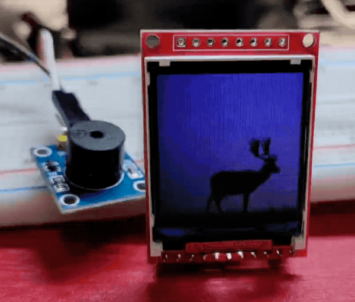
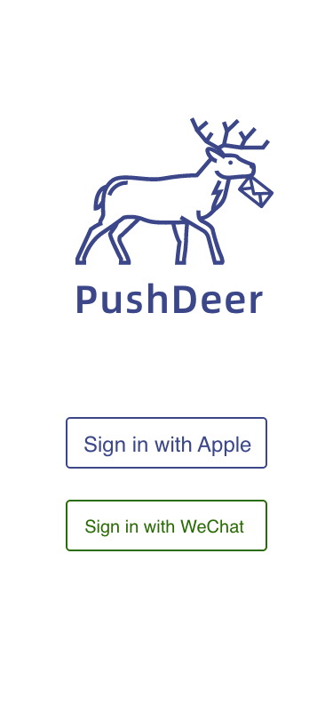
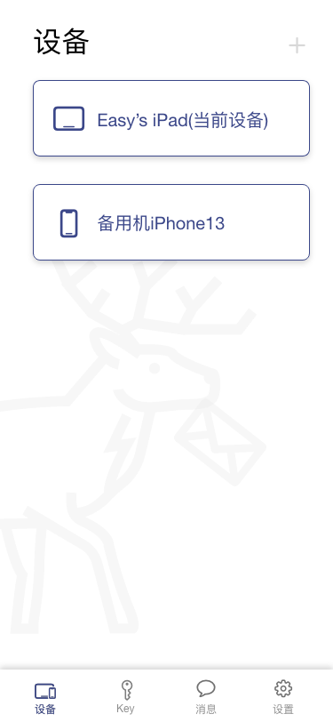
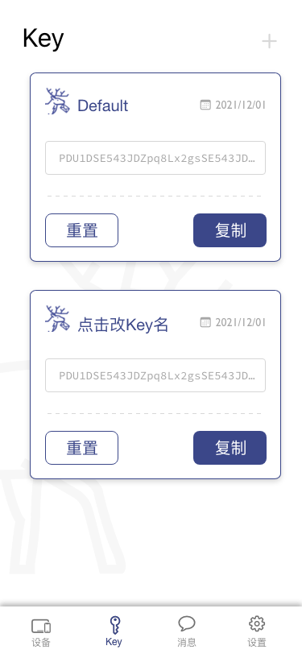
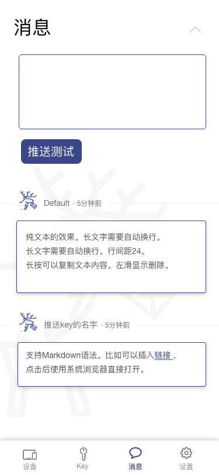
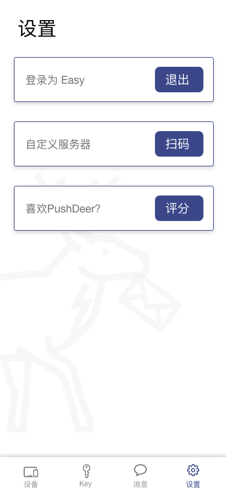
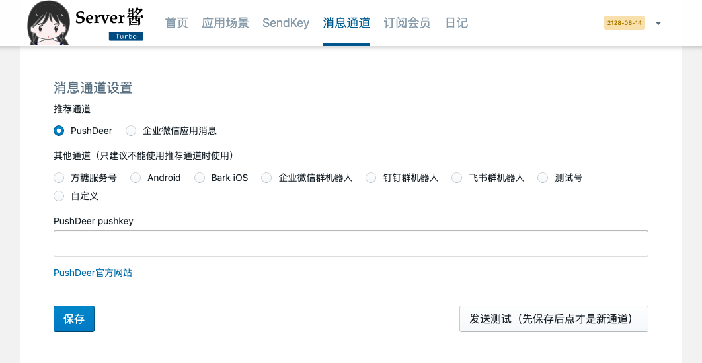
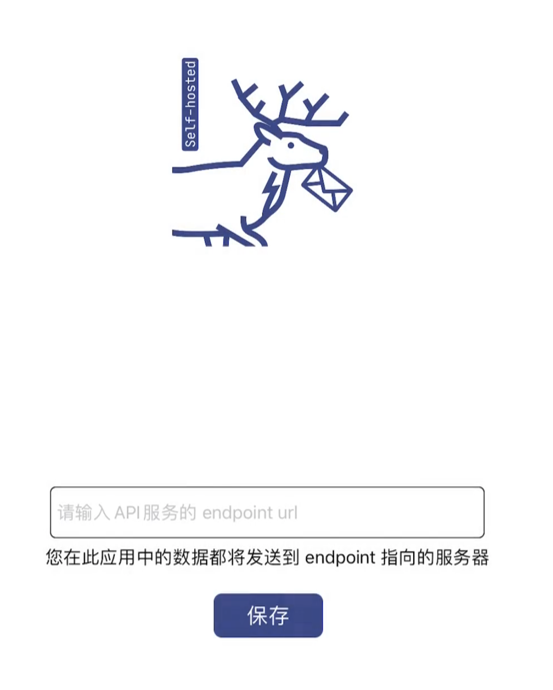
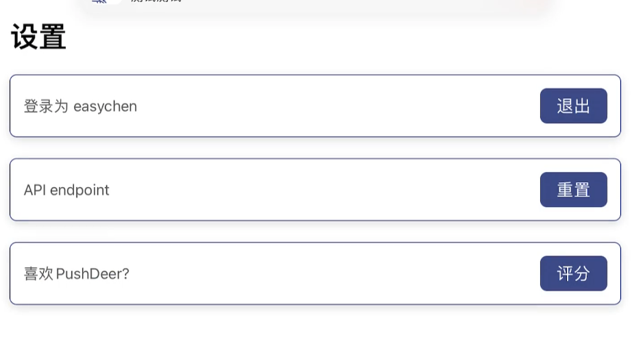

> ⚠️ 目前，官方架设的Android版本因接口权限停止无法使用，[详情请点击](https://github.com/easychen/pushdeer/issues/150)

> ⚠️ 自架版服务器端需每年更新推送证书，如果之前架设的服务突然无法收到推送，请尝试拉取部署最新代码

PushDeer是一个可以自行架设的无APP推送服务，同时也为因为某些原因无法使用无APP推送方案的同学提供有APP/自制设备方案。

[🐙🐱 GitHub仓库](https://github.com/easychen/pushdeer) [🔮 中国大陆镜像仓库@Gitee](https://gitee.com/easychen/pushdeer)

本项目已经实现的方案/端包括：

- 无APP方案：
  - 轻APP（APP Clip）
  - 快应用
- 有APP方案：
  - iOS客户端
  - Mac客户端
  - Android客户端
- 自制设备方案：
  - DeerESP（ESP8266/ESP32）



👉[点此查看如何将PushDeer消息推送到成本不到40元的自制设备上](iot/README.md) 

---

|登入|设备|Key|消息|设置|
|-|-|-|-|-|
|||||

# 子项目和核心贡献者

|功能|核心贡献人|预期完成时间|最低版本兼容|本周进度|
|-|-|-|-|-|
|iOS客户端/Mac客户端/轻APP|[Hext123](https://github.com/Hext123)|已完成|iOS14|第一版完成，代码在iOS目录下|
|Android客户端|[WolfHugo](https://github.com/alone-wolf)|已完成|5.1|第一版开发完成，release页面可下载。Websocket方案准备中|
|快应用|[7YHong](https://github.com/7YHong)|已完成|-|代码在[quickapp目录下](quickapp)，可自行上架|
|物联网版本DeerESP|[Easy](https://ftqq.com) |已完成|-|代码在[iot目录下](iot)，专用设备PCB和外壳设计中|
|API|[Easy](https://ftqq.com) [古俊杰](https://github.com/ilovintit)|已完成|-|-|
|gorush的mi push版本|[SinTod](https://www.sintod.cn/)|已完成|-|代码在[push/gorush-with-mipush目录下](push/gorush-with-mipush)|


# 试用


## 使用官方在线版本

官方在线版不用自行架设服务器端，只需启动客户端即可

### iOS14+


苹果手机（iOS 14+）用系统摄像头扫描上边的码即可拉起轻应用。亦可在苹果商店搜索「PushDeer」安装。

> 注意：这里不要安装PushDeer自架版

### MacOS 11+

PushDeer有Mac客户端，亦支持推送。可在Mac应用商店中搜索「PushDeer」安装。

### Android

快应用尚在开发，可下载并安装Android测试版APP([GitHub](https://github.com/easychen/pushdeer/releases/tag/android1.0alpha)|[Gitee](https://gitee.com/easychen/pushdeer/releases/android1.0alpha))。


### 发送消息

1. 通过apple账号（或微信账号·仅Android版支持）登录
1. 切换到「设备」标签页，点击右上角的加号，注册当前设备
1. 切换到「Key」标签页，点击右上角的加号，创建一个Key
1. 通过访问后边的URL即可推送内容：https://api2.pushdeer.com/message/push?pushkey=key&text=要发送的内容

> 注意注册设备用到了device token，应用一旦重装，device token会变，所以需要重新注册一次。

### 发送实例

发送文字：

```
https://api2.pushdeer.com/message/push?pushkey=key&text=要发送的内容
```

发送图片：

```
https://api2.pushdeer.com/message/push?pushkey=<key>&text=<图片URL>&type=image
```

发送Markdown：

```
https://api2.pushdeer.com/message/push?pushkey=<key>&text=标题&desp=<markdown>&type=markdown
```

在URL中可以用`%0A`换行，当参数中有特殊字符时，需要进行urlencode，因此更建议通过函数或者SDK发送。

- [Python SDK](https://github.com/gaoliang/pypushdeer) by [Gao Liang](https://github.com/gaoliang)
- [Go SDK](https://github.com/Luoxin/go-pushdeer-sdk) by [Luoxin](https://github.com/Luoxin)
- [Rust SDK](https://github.com/abgelehnt/rupushdeer) by [Chi](https://github.com/abgelehnt)

PHP函数：

```php
function pushdeer_send($text, $desp = '', $type='text', $key = '[PUSHKEY]')
{
    $postdata = http_build_query(array( 'text' => $text, 'desp' => $desp, 'type' => $type , 'pushkey' => $key ));
    $opts = array('http' =>
    array(
        'method'  => 'POST',
        'header'  => 'Content-type: application/x-www-form-urlencoded',
        'content' => $postdata));
    
    $context  = stream_context_create($opts);
    return $result = file_get_contents('https://api2.pushdeer.com/message/push', false, $context);
}
```

### 将 PushDeer 接入 ServerChan 

由于 PushDeer 刚开发，很多软件和平台都尚未整合其接口，你可以将 PushDeer 接入Server酱作为通道使用，效果是：

1. 使用`sendkey`调用Server酱接口
2. 在 PushDeer 客户端收到通知

接入方式如下：

1. 登入 sct.ftqq.com ，选择「消息通道」页面，选择「推荐通道」中的「PushDeer」
1. 将在PushDeer客户端中生成的Key填入即可



如果你使用的是自架服务器，那么也可以通过「其他通道」中的「自定义」来修改转发格式和文案。具体操作是，在「自定义 WebHook 配置用 json」中填入以下内容:

```json
{
	"url":"<endpoint>/message/push?pushkey=<pushkey>",
	"values":[
		{"type":"markdown"},
                 {"text":"{{title}} "},
                 {"desp":"{{desp}} [查看详情]({{url}})"}
	]
}
```

注意将 `<endpoint>` 换成你自架服务器的地址，将 `{{pushkey}}` 换成你自己的 PushDeer 账号中的 key，保存即可。可点右侧的测试按钮测试效果。

## 使用自架服务器端和自架版客户端

### 自架服务器端

除了使用官方架设的服务器端，你也可以架设自己的服务器端。本仓库支持通过docker部署服务器端。

如果你没有云服务器，可以看看[腾讯云30~50元首单的特价服务器](https://curl.qcloud.com/VPjlS4gj)

#### Docker-compose

首先请确保服务器(假设其IP或域名为$AAA)上支持docker和docker-compose。

然后运行以下代码：

```
git clone https://github.com/easychen/pushdeer.git
cd pushdeer
docker-compose -f docker-compose.self-hosted.yml up --build -d
```

如果你的服务器连接GitHub有困难，可以使用Gitee的代码，但需要核对是否为最新版本（有可能没同步）
```
git clone https://gitee.com/easychen/pushdeer.git
cd pushdeer
docker-compose -f docker-compose.self-hosted.yml up --build -d 
```

> 如提示docker服务未安装/找不到/未启动，可在 docker-compose 前加 sudo 再试

等待初始化完成后，访问 `$AAA(需替换为服务器端IP或域名):8800`，看到扫码提示和图片则说明容器已经启动。

> ⚠️ 自架服务器端需每年2月拉取一次更新推送证书

如果您在部署中遇到问题，可按[调试文档](/doc/调试文档.md)定位并发现错误信息。

<!--
#### 单一容器部署方案

对于很多不能运行docker-compose的容器环境，可以直接使用 pushdeer 镜像。该镜像中已经包含了 redis 服务，但需要通过环境变量指定数据库等信息：

```
docker run -e DB_DATABASE=* -e DB_HOST=* -e DB_PORT=*28740* -e DB_USERNAME=* -e DB_PASSWORD=* -e DB_TIMEZONE=+08:00  -e WEB_PHP_SOCKET=127.0.0.1:8000 -p 9000:9000 ccr.ccs.tencentyun.com/ftqq/pushdeercore
```

请将上述命令中的`*`替换为对应的数据库信息。
-->

### 使用自架版客户端


在苹果商店搜索「PushDeer·自架版」安装并启动。



在启动界面输入 `$AAA(需替换为服务器端IP或域名):8800`，点保存。如果通信顺利，即可顺利完成「通过Apple登录」。如输入错误，可点击「重置API endpoint」重新输入。


登入成功后，亦可随时在设置页面重置 API endpoint。




### 生产环境的配置强化/优化

参见[𐂂安装文档](doc/安装文档.md)


# 关于轻应用

> 轻应用找不到了怎么办？

在搜索框搜索pushdeer就能找到。

> 轻应用怎么清理掉?占空间么?

系统设置里边有一个轻应用管理，在里边可以清理。30天不用会自动清理掉。注意重新安装后设备id会变动，需要再手动注册一遍。

# 开发说明

视频版设计文档：  [📼 项目视频说明](https://www.bilibili.com/video/BV1Ar4y1S7em/) [📼 项目架构和模块说明](https://www.bilibili.com/video/BV1ZS4y1T7Bf/)


## 目录说明

- api: Laravel实现的API接口，[点此查看请求和返回demo](doc/api/PushDeerOS.md)
- docker: API实现的docker封装，一键启动，方便使用
- doc: 文档目录，包括界面设计源文件（Adobe XD）和资源文件（logo和avatar）
- push: 基于 [gorush](https://github.com/appleboy/gorush) 架设的推送微服务，配置文件开启 async 可以提升发送速度
- ios: 用于放置 iOS 源文件，`ios/Prototype_version` 目录是我边学边写的原型验证版本（SwiftUI+Moya+Codable），很多地方需要重写，仅供参考
- quickapp: 用于放置快应用源代码
- android: 用于放置安卓客户端源代码

## 开发环境搭建

### 下载代码

```git clone https://github.com/easychen/pushdeer.git```


### 启动docker环境

运行 `docker-compose up -d`，启动API。默认访问地址为`http://127.0.0.1:8800`。可修改`docker-compose.yml`调整端口。


### API 说明

[在线文档（Swagger）](https://ilovintit.github.io/pushdeer-api-doc/#/) 

API_BASE=http://127.0.0.1:8800

认证方式：通过登入接口获得`token`，通过`post`和`get`方式附带`token`参数即可自动登入。

#### 模拟登入(环境变量APP_DEBUG=true时可用)

`GET /login/fake`

#### 通过苹果 idToken 登入

`POST /login/idtoken`

|参数|说明|备注|
|-|-|-|
|idToken|Sign in with Apple 中得到的 idToken|

#### 通过微信 oauth code 登入

`POST /login/wecode`

|参数|说明|备注|
|-|-|-|
|code|客户端微信授权得到的code|


#### 合并用户并将旧用户删除

`POST /user/merge`

|参数|说明|备注|
|-|-|-|
|token|认证token|
|type|字符串，必须为 apple 或者 wechat|
|tokenorcode|type 为 apple时此字段为 idToken，否则为 微信code |

#### 获得当前用户的基本信息

`POST /user/info`

|参数|说明|备注|
|-|-|-|
|token|认证token|

#### 注册设备

`POST /device/reg`

|参数|说明|备注|
|-|-|-|
|token|认证token|
|name|设备名称|
|device_id|device token（推送用）|
|is_clip|是否轻应用|0为APP|

#### 设备列表

`POST /device/list`

|参数|说明|备注|
|-|-|-|
|token|认证token|

#### 重命名设备

`POST /device/rename`

|参数|说明|备注|
|-|-|-|
|token|认证token|
|id|设备id|
|name|设备新名称|

#### 移除设备

`POST /device/remove`

|参数|说明|备注|
|-|-|-|
|token|认证token|
|id|设备id|

#### 生成一个新Key

`POST /key/gen`

|参数|说明|备注|
|-|-|-|
|token|认证token|

#### 重命名Key

`POST /key/rename`

|参数|说明|备注|
|-|-|-|
|token|认证token|
|id|Key ID|
|name|Key新名称|

#### 重置一个Key

`POST /key/regen`

|参数|说明|备注|
|-|-|-|
|token|认证token|
|id|Key ID|

#### 获取当前用户的Key列表

`POST /key/list`

|参数|说明|备注|
|-|-|-|
|token|认证token|

#### 删除Key

`POST /key/remove`

|参数|说明|备注|
|-|-|-|
|token|认证token|
|id|Key ID|


#### 推送消息

`POST /message/push`

|参数|说明|备注|
|-|-|-|
|pushkey|PushKey|多个key用`,`隔开，在线版最多10个，自架版默认最多100个|
|text|推送消息内容|
|desp|消息内容第二部分，选填|
|type|格式，选填|文本=text，markdown，图片=image，默认为markdown|

type 为 image 时，text 中为要发送图片的URL。

#### 获得当前用户的消息列表

`POST /message/list`


|参数|说明|备注|
|-|-|-|
|token|认证token|
|limit|消息条数|默认为10，最大100

#### 删除消息

`POST /message/remove`

|参数|说明|备注|
|-|-|-|
|token|认证token|
|id|消息ID|

#### 清除全部消息

`POST /message/clean`

|参数|说明|备注|
|-|-|-|
|token|认证token|

#### Simple token
> 为了方便客户端永久保持登入状态，我们提供了一个永不失效的Token，即 Simple token

##### 获取 Simple token
通过 上文中的「获得当前用户的基本信息」接口(`POST /user/info`) 得到

##### 通过 Simple token 登入

`POST /login/simple_token`

|参数|说明|备注|
|-|-|-|
|stoken|Simple token|

登入成功返回认证token。

##### 重置 Simple token 

`POST /simple_token/regen`

|参数|说明|备注|
|-|-|-|
|token|认证token|

##### 清空 Simple token 

`POST /simple_token/remove`

|参数|说明|备注|
|-|-|-|
|token|认证token|


[更详细的请求和返回值可以参考这里](doc/api/PushDeerOS.md)

通用返回格式：

```
{
    code:正确为0，错误为非0,
    content:内容,错误时无此字段，
    error:错误信息，无错误时无此字段
}
```


# 产品设计文档

## 产品定义

PushDeer的**核心价值**，包括：「易用」、「可控」和「渐进」。

### 易用

易用性表现在两个方面：

1. 易安装：采用无APP方案，直接**去掉安装步骤**
1. 易调用：只需输入URL，**无需阅读文档**，就可以发送消息

### 可控

1. `Self-hosted`：让有能力和精力的用户可以自行架设，避免因为在线服务下线导致的接口更换风险。
1. 非商用免费：不用PushDeer挣钱，就无需支付费用
1. 不依赖微信消息接口：不像Server酱那样受腾讯政策影响

### 渐进

1. 通过URL即可发送基本的文本消息；通过更多参数，可以对消息的样式等细节进行调整
1. 无APP不能实现的功能不能覆盖的机型，后期可以通过APP来补充

## 商业模式

PushDeer是一个商业开源项目，采用「开放源码」、「自用免费」、「在线服务收费」的方式进行运作。

### 具体实现

PushDeer是一个以盈利为目的的商业项目，品牌和源码所有权都由「方糖君」公司持有，但和纯商业项目不同的地方在于：

1. 它开放源代码，所有人都可以在非商业前提下按GPLv2授权使用
1. 它接受社区贡献代码，作为回报，它会从商业收益中拿出部分来赞助项目贡献人
1. 如果商业收益够大，它会尝试雇佣项目贡献人以兼职或者全职的方式为项目工作

这里边有一些细节：

1. 为了避免某些个人或者公司使用源码搭建在线竞品服务收费，我们限制了源码不能商用
1. 在刚开始的时候，项目并没有商业收入，而却是开发工作量最大的。所以首先我们会承担产品和界面设计、API设计和开发等工作；并通过众筹的方式筹集了一些资金给其他大模块的贡献人

开放源码形式保证了其他代码贡献人在非商业场景下对源码的可控：

1. 如果社区和代码贡献人不满意「方糖君」主导的商业化，可以 Fork 一个版本，继续在非商用的前提下自行运营
1. 如果「方糖君」之后不再开放源代码，普通用户依然可以按之前的协议使用修改协议前的源码

## 用户细分

PushDeer主要面向以下三类用户

1. 高阶电脑用户
1. 开发者
1. 公司或自媒体

### 高阶电脑用户

具有一定电脑操作技能的高阶用户，比如：

1. NAS 用户
1. 站长
1. 电脑技术爱好者

他们使用PushDeer的场景包括但不限于：

1. 推送路由器和 NAS 的状态、公网 IP 等信息
1. 推送 Wordpress 最新的评论
1. 推送加密货币达到特定价格的通知
1. 在多台设备上推送文本
1. 自动化工具推送定期汇报

### 开发者

使用PushDeer的场景包括但不限于：

1. 推送报错和调试信息
1. 推送服务器异常
1. 推送定时任务输出
1. 在自己的软件发送消息到手机（引导用户填入PushDeer的key）

### 公司或自媒体

使用PushDeer的场景包括但不限于：

1. 面向自己的用户推送通知、内容和营销信息（类似公众号，但不受微信限制）


# 授权

本项目禁止商用（包括但不限于搭建后挂广告或售卖会员、打包后上架商店销售等），在非商用的情况下遵循GPL v2，当两者冲突时，以非商用原则优先。


# 相关项目

- [C# SDK](https://gitee.com/mrbread/pushdeer_csharp_sdk) by [MrBread](https://gitee.com/mrbread)
- [Java SDK](https://gitee.com/mrbread/pushdeer-java-sdk) by [MrBread](https://gitee.com/mrbread)
- [Python SDK](https://github.com/gaoliang/pypushdeer) by [Gao Liang](https://github.com/gaoliang)
- [API的Go实现](https://github.com/iepngs/pushdeer-backend-go) by [iepngs](https://github.com/iepngs)
- [API的Node实现](https://github.com/xkrfer/pushdeer-node) by [DouDou](https://github.com/xkrfer)
- [浏览器插件](https://github.com/xkrfer/pushdeer-crx) by [DouDou](https://github.com/xkrfer)
- [Rust SDK](https://github.com/abgelehnt/rupushdeer) by [Chi](https://github.com/abgelehnt)
