> PushDeer可以将消息推送到各种支持MQTT协议的智能设备。

DeerESP 是 PushDeer 在 IOT 方向的扩展项目，它是一个基于 ESP8266/ESP32 芯片的消息设备方案。

目前你可以通过以下方式获得这个终端：

- 方案1：直接购买为 PushDeer 设计的、组装好的、带3D打印外壳的硬件（价格为60左右）
- 方案2：购买为 PushDeer 设计的、带3D打印外壳的、未焊接和组装的散件（价格为50左右）
- 方案3：通过开源的硬件方案自行印制电路板、购买元件并焊接（十件均价25左右，屏幕10元左右）
- 方案4：直接购买8266开发板、屏幕和蜂鸣器，连线使用（35元左右）

其中方案1和方案4无需焊接，主要区别在集成度和外壳；方案2和方案3需要较强的动手能力，适合会焊接的同学。

## 方案1/方案2效果：

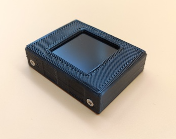  

128*128 1.44寸屏幕效果

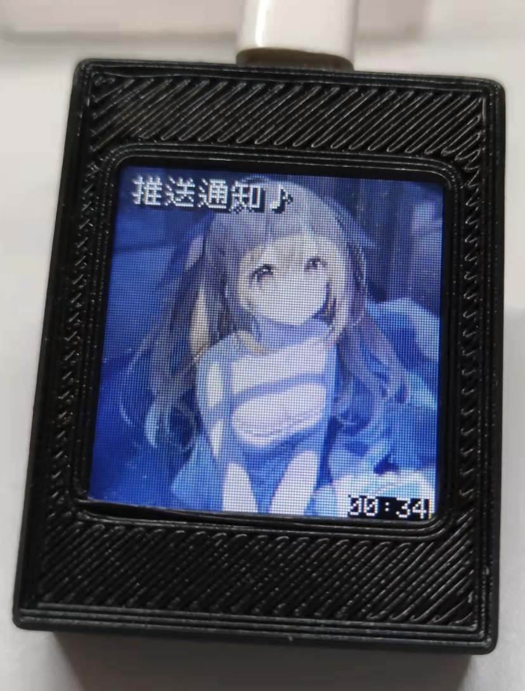  

240*240 1.3寸屏幕效果

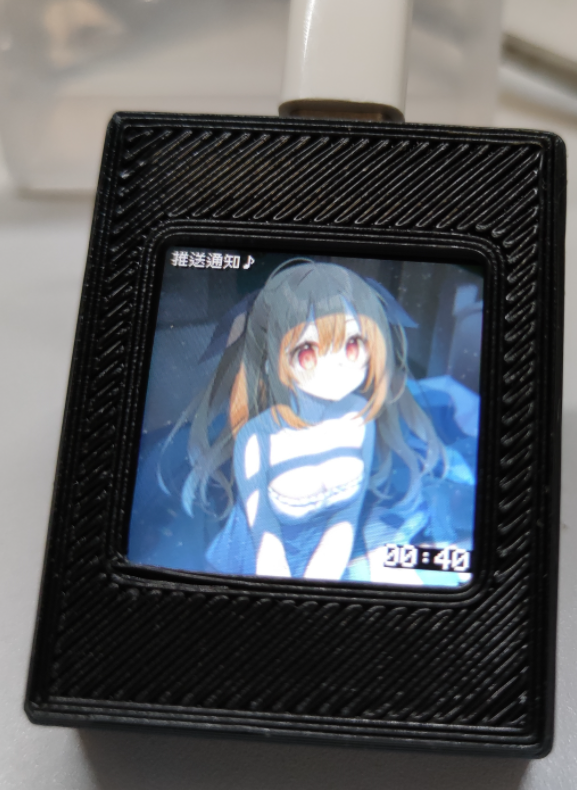 

另有白色外壳版本。

## 方案3效果：

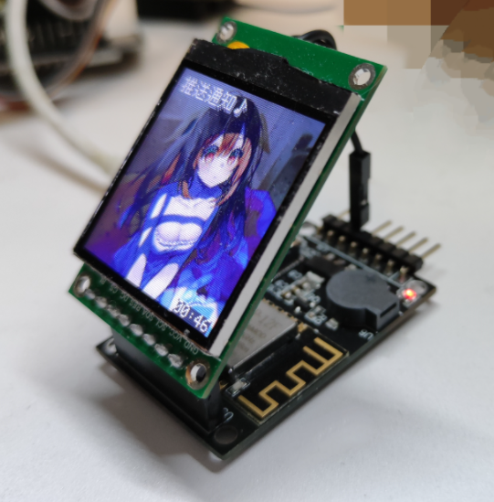  

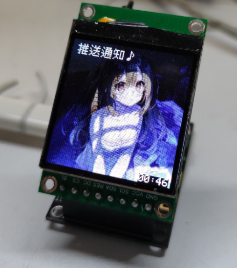  

## 方案4效果：

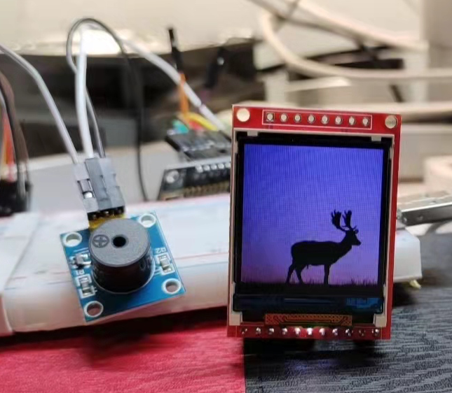 


[📼 点此查看视频版本，可以听到提示音♪](https://weibo.com/1088413295/LfUwivPoh)


以下我们将针对上述方案提供对应的教程。


## 硬件的购买

### 方案1/2

在[淘宝店铺](https://item.taobao.com/item.htm?ft=t&id=673259250981)进行购买：
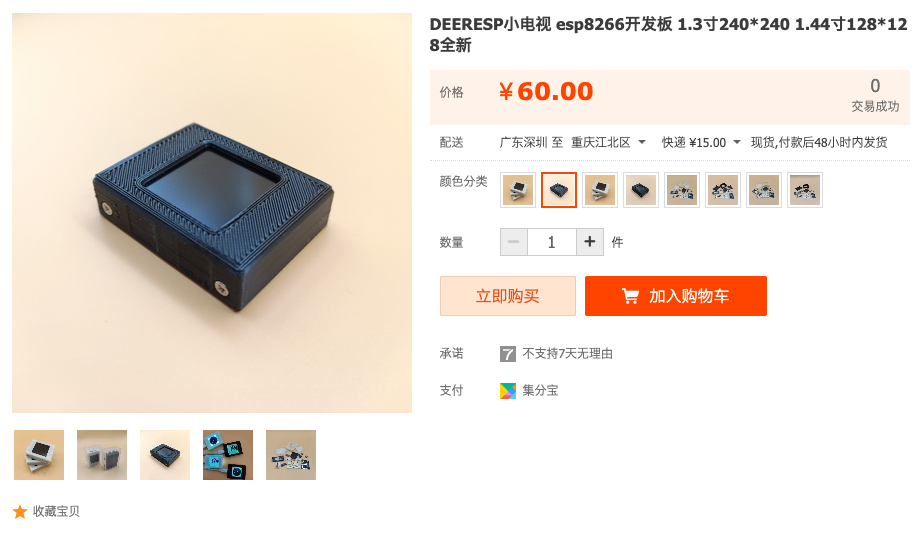  

> 感谢店长`nickchen`贡献[开源硬件方案](https://gitee.com/nickchenss/deepesp-v2/tree/master/DEEP%20V2)，硬件的品质将由店家自行负责。

### 方案3 

在[硬创社](https://x.jlc.com/platform/detail/1a987c9a4d4347efaef4f425f3a408d0) 一键下单，通过嘉立创在线制作。

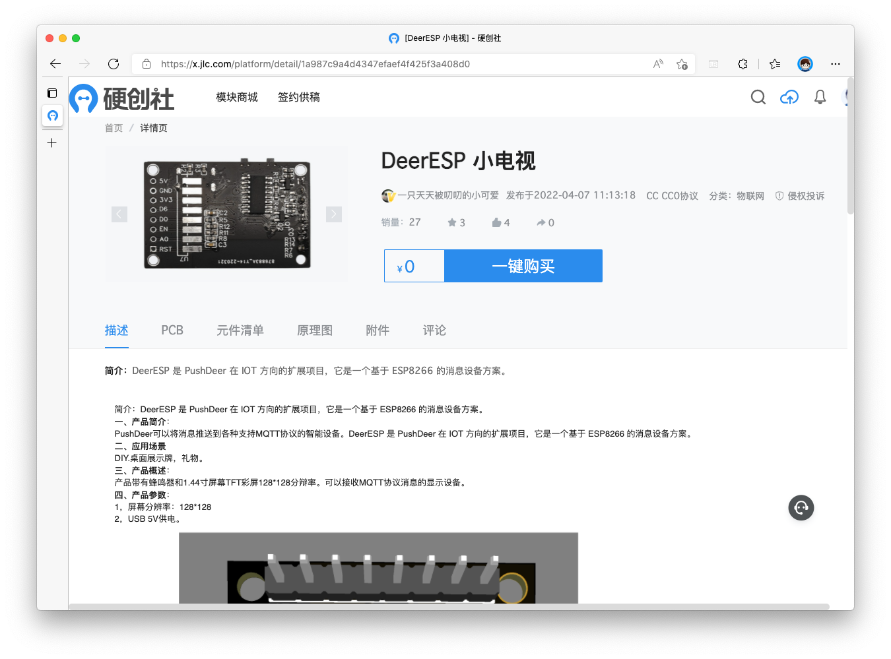  

相关资料也可以在[Gitee](https://gitee.com/nickchenss/deepesp-v2/tree/master/DEEP%20V2)上获得。

可参考：[B站嘉立创免费打样教程](https://www.bilibili.com/video/BV1eh41147ka?spm_id_from=333.337.search-card.all.click)

### 方案4

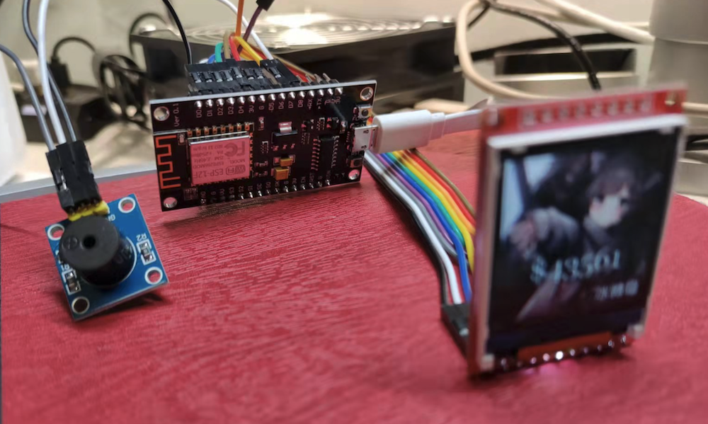

1. 开发板：只要是兼容NodeMCU1.0规范的就行，内存需要4M（32Mbits），更大更好（就能放中文字库了）我选的是CH340接口
1. 屏幕：[1.44寸黑色TFT](http://www.lcdwiki.com/zh/1.44inch_SPI_Arduino_Module_Black_SKU:MAR1442)，其他兼容ST7735驱动的屏幕也可以，但连线可能就不同了，需要自己配置屏幕库
1. 蜂鸣器（可选）：来消息时播放提示音

前边两个加上USB线，[淘宝33.30](https://item.taobao.com/item.htm?spm=a1z09.2.0.0.2c042e8dlNdY3E&id=531755241333&_u=gog6id51b2)，无源蜂鸣器：[淘宝3.3](https://detail.tmall.com/item.htm?id=41251333522&spm=a1z09.2.0.0.2c042e8dlNdY3E&_u=gog6id9820&skuId=4323951807546)。不认识店家，就随便搜了就买了。

## 硬件的连接

### 方案1 

无需连接

### 方案2

店家会提供焊接和组装教学视频，请询问店家。

### 方案3 

请参考开源硬件资料中的原理图进行连接。

### 方案4

首先把屏幕和开发板连起来，按下图操作：


然后再把蜂鸣器和开发板连起来

|蜂鸣器|开发板|
|-|-|
|GND|G|
|VCC|3V|
|IO|D8|

如果你的连线不同，那么程序中的PIN值可能需要随之调整。

## 将开发板和电脑连起来

### 串口驱动安装

用USB线将开发板和电脑连起来，但这时候它们之间还不能通信，因为开发板用串口信号，电脑用USB信号，需要进行转换。

一般NodeMCU开发板上有自带转换芯片，比如CH3XX或者CPXXX，这里以CH340为例。去它们官网下载[最新的驱动](http://www.wch.cn/products/ch340.html)安装后，两者就能通信了。


## 配置开发环境

我们使用 `arduino` 开发环境进行开发，在此之前需要[下载并安装它的IDE](https://www.arduino.cc/en/software)。


由于我们使用的8266并没有内置到 `ardunio IDE` 中，我们还需要进行一下配置，在设置界面填上附加开发板管理器网址：`https://arduino.esp8266.com/stable/package_esp8266com_index.json`

> esp32 填写这个 https://raw.githubusercontent.com/espressif/arduino-esp32/gh-pages/package_esp32_index.json


然后在 `工具`→`开发板管理`中搜索 `8266` 并安装，选择 `工具`→`开发板`→`ESP8266 Boards`→`NodeMCU1.0` 切换过来。


再调整下开发板使用的串口：

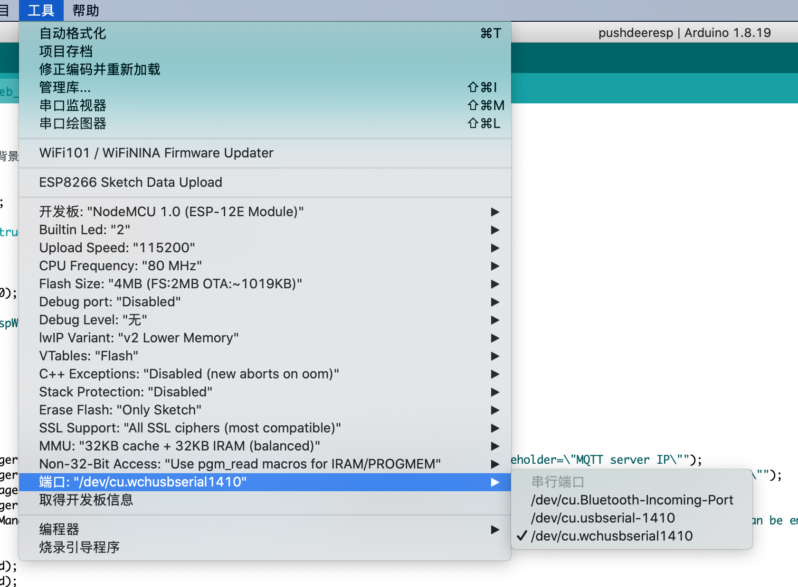

要确认哪一个串口是开发板的很简单，你拔掉它就不见了…

这些准备工作做好以后，我们就可以将代码烧录到设备上了。但在这之前，我们需要把MQTT服务器架设起来，之后我们才能把账号等信息烧录进去。


## 使用MQTT接受PushDeer推送的消息

PushDeer自架版支持通过MQTT协议向兼容的设备（以下简称设备）发送信息，其主要工作原理是：

1. 自架版docker-compose文件中预置了MQTT服务器，手动开启后，设备可以通过配置的端口连接到服务器
1. 设备通过订阅主题实时获得消息，文字类型（text/markdown）消息主题为：`{{pushkey}}_text`， 图片类型的主题为`{{pushkey}}_bg_url`

### 开启MQTT服务

修改根目录下的 `docker-compose.self-hosted.yml`:

```yml
  app:
    #image: 'webdevops/php-apache:8.0-alpine'
    build: './docker/web/'
    ports:
      - '8800:80'
    volumes:
      - './:/app'
    depends_on:
      - mariadb
      - redis
    environment:
      - DB_HOST=mariadb
      - DB_PORT=3306
      - DB_USERNAME=root
      - DB_DATABASE=pushdeer
      - DB_PASSWORD=theVeryp@ssw0rd
      - GO_PUSH_IOS_TOPIC=com.pushdeer.self.ios
      - GO_PUSH_IOS_CLIP_TOPIC=com.pushdeer.self.ios.Clip
      - APP_DEBUG=false
      - MQTT_API_KEY=9LKo3
      - MQTT_ON=false <---- 这里改为 true 
      # 下边去掉注释
  # mqtt:
  #   image: 'ccr.ccs.tencentyun.com/ftqq/pushdeeresp'
  #   ports:
  #     - '1883:1883'
  #   environment:
  #     - API_KEY=9LKo3 <---- 这里和上边的MQTT_API_KEY值一致
  #     - MQTT_PORT=1883
  #     - MQTT_USER=easy <---- 自己起一个用户名
  #     - MQTT_PASSWORD=y0urp@ss <---- 自己起一个密码
  #     - MQTT_BASE_TOPIC=default  
```

修改完成后类似：

```yml
      - MQTT_API_KEY=2134grt
      - MQTT_ON=true
  mqtt:
    image: 'ccr.ccs.tencentyun.com/ftqq/pushdeeresp'
    ports:
      - '1883:1883'
    environment:
      - API_KEY=2134grt
      - MQTT_PORT=1883
      - MQTT_USER=mynameisLili
      - MQTT_PASSWORD=howoldareU
      - MQTT_BASE_TOPIC=default  
```

再通过以下命令启动服务：

```bash
docker-compose -f docker-compose.self-hosted.yml up --build -d
``` 

### 连接参数实例

这里以上边的设置为例，详细说明MQTT连接中用到的值，假设你的`Pushkey` 为 `PDU01234`，那么：

1. MQTT服务器的IP为你架设PushDeer服务的IP，注意127.0.0.1和localhost是环回地址，如果想其他设备能连接，至少需要局域网IP（设备在同一个局域网里）或者公网IP。
1. MQTT用户名为：`mynameisLili` （MQTT_USER）
1. MQTT密码为：`howoldareU`（MQTT_PASSWORD）

有了上边三个信息，你就可以连接上MQTT服务了。如果你不想要访问权限控制，可以这样：

```yml
      - MQTT_USER=
      - MQTT_PASSWORD=
```

连上服务器以后，还需要知道`topic`才能接收消息，你可以把它当成消息分组名称，只有订阅了这个分组，才能收到对应的消息。

当设置 `MQTT_ON=true` 以后，在发送信息时，PushDeer会抄送一份给MQTT，这样连接着的设备就可以收到消息了。为了方便设备进行消息处理，我们分两个分组抄送信息：

1. text/markdown类型的消息会通过`PDU01234_text`发送
1. image类型的消息会通过`PDU01234_bg_url`发送
1. 完整的消息数据会通过`PDU01234_payload`发送，格式为JSON

## 烧录程序到设备

### 选择要烧录的版本

因为8266的内存多为4M，难以同时放下配网和中文字库，我们提供了两个版本的源代码：

- deeresp/deeresp.ino：2000字中文字库，手动填写wifi和mqtt信息
- deeresp32/deeresp32.ino：支持配网和保存配置文件、可选BG2312中文字库，建议8M以上设备使用

以上版本都包含了图片、文字推送，支持提示鸣音以及联网时钟功能。

### 具体操作

回到我们的设备这边来。首先用 `arduino IDE` 打开 `deeresp/deeresp.ino`，按提示修改最上边的几行：

```cpp
#define SCREEN_WIDTH 128 // 如果是 240*240 的屏幕，请调整这两行
#define SCREEN_HEIGHT 128
#define SCREEN_ROTATION 0 // 这个是屏幕方向
#define WIFI_SSID "wifi名称"
#define WIFI_PASSWORD "wifi密码"
#define MQTT_CLIENT_NAME "DeerEsp-001" // 多个同名设备连接同一台服务器会导致其他下线，所以起一个唯一的名字吧
#define MQTT_TOPIC "LB2312" // 这里填PushDeer的Key
```

这里的信息我们现在都有了，把它们替换掉，然后点击上传图标（向右的箭头），就会编译并烧录程序到设备上了。不过别急，有两个问题需要处理。


### 添加缺少的库

如果你在编译的过程中遇到了错误，那么多半是因为缺少库导致的。可以直接在IDE中搜索添加。以 `TJpg_Decoder` 库为例，点开`项目`→`加载库`→`管理库`。

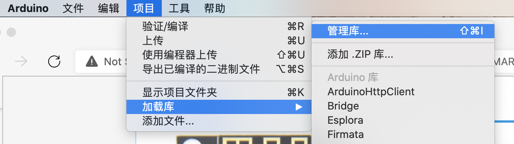

在弹出的`库管理器`窗口里输入库的名字进行搜索，选择对应库并点击`安装`即可。


### 屏幕适配

我们使用了 `TFT_eSPI` 这个库来控制屏幕，它可以适配非常多的屏幕，但我们并没有在代码中告诉它我们用的屏幕是哪一款。这是因为，它要靠修改源代码目录的配置文件来实现的。

在首选项中找到`项目文件夹`位置。


打开该目录，然后找到 `User_Setup.h`文件。

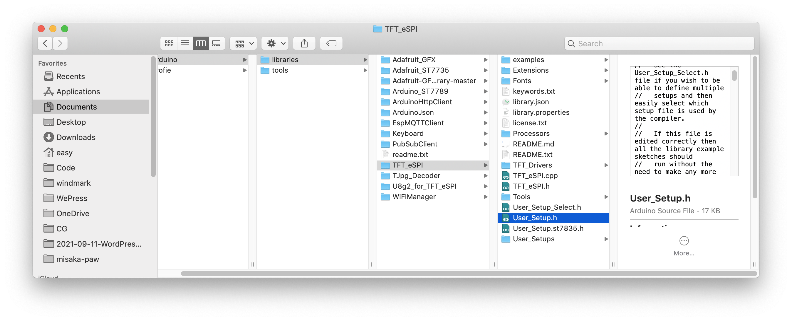

注释或删除掉默认驱动及其他内容

```cpp
//#define ILI9341_DRIVER
```

然后根据不同的方案添加以下内容：

#### 方案1/2/3：deeresp + 1.44寸128*128 ST7735屏幕

```cpp
#define ST7735_DRIVER
#define TFT_RGB_ORDER TFT_BGR
#define TFT_WIDTH  128
#define TFT_HEIGHT 128
#define ST7735_GREENTAB3 
#define TFT_MOSI PIN_D7
#define TFT_SCLK PIN_D5
#define TFT_CS   PIN_D1
#define TFT_DC   PIN_D3
#define TFT_RST  PIN_D2
#define LOAD_GLCD   
#define LOAD_FONT2  
#define LOAD_FONT4  
#define LOAD_FONT6  
#define LOAD_FONT7  
#define LOAD_FONT8  
#define LOAD_GFXFF
#define SMOOTH_FONT
#define SPI_FREQUENCY  27000000
#define SPI_READ_FREQUENCY  20000000
#define SPI_TOUCH_FREQUENCY  2500000
```
#### 方案1/2/3：deeresp + 1.3寸240*240 ST7789屏幕

```cpp
#define CGRAM_OFFSET 
#define ST7789_DRIVER 
#define TFT_RGB_ORDER TFT_BGR 
#define TFT_WIDTH  240 
#define TFT_HEIGHT 240
#define TFT_MOSI PIN_D7
#define TFT_SCLK PIN_D5
#define TFT_CS   PIN_D1
#define TFT_DC   PIN_D3
#define TFT_RST  PIN_D2
#define LOAD_GLCD   
#define LOAD_FONT2  
#define LOAD_FONT4  
#define LOAD_FONT6  
#define LOAD_FONT7  
#define LOAD_FONT8  
#define LOAD_GFXFF
#define SMOOTH_FONT
#define SPI_FREQUENCY  27000000
#define SPI_READ_FREQUENCY  20000000
#define SPI_TOUCH_FREQUENCY  2500000
```

####  方案4：NodeMCU + 1.44寸128*128 ST7735屏幕

```cpp
#define ST7735_DRIVER  
#define TFT_RGB_ORDER TFT_BGR 
#define TFT_WIDTH  128
#define TFT_HEIGHT 128
#define ST7735_GREENTAB3
#define TFT_CS   PIN_D1  
#define TFT_DC   PIN_D3  
#define TFT_RST  PIN_D2  
#define LOAD_GLCD   
#define LOAD_FONT2  
#define LOAD_FONT4  
#define LOAD_FONT6  
#define LOAD_FONT7  
#define LOAD_FONT8  
#define LOAD_GFXFF  
#define SMOOTH_FONT
#define SPI_FREQUENCY  27000000
#define SPI_READ_FREQUENCY  20000000
#define SPI_TOUCH_FREQUENCY  2500000
```

然后再打开同目录下的 `TFT_eSPI.h`，找到 `User_select.h`，打开注释：

```cpp
#include <User_Setup.h>
// #include <User_Setup_Select.h>
```

这些操作完成后再编译就会发现屏幕正常显示了。如果显示不正常（比如图片颜色、大小不对等），这有可能是因为你用的屏幕硬件规格和我们这里的不同，可以参照注释尝试修改那些配置项。

## 初始化SPIFFS文件系统

如果遇到图片显示不出来），串口提示`SPIFFS: mount failed`，这是因为文件系统没有初始化。

你可以下载一个arduino插件来解决这个问题：

- [ESP8266](https://github.com/esp8266/arduino-esp8266fs-plugin)
- [ESP32](https://github.com/me-no-dev/arduino-esp32fs-plugin) 

下载后按项目页面提示放到对应的目录，重启arduino IDE就可以从下边菜单中看到多出来的选项：

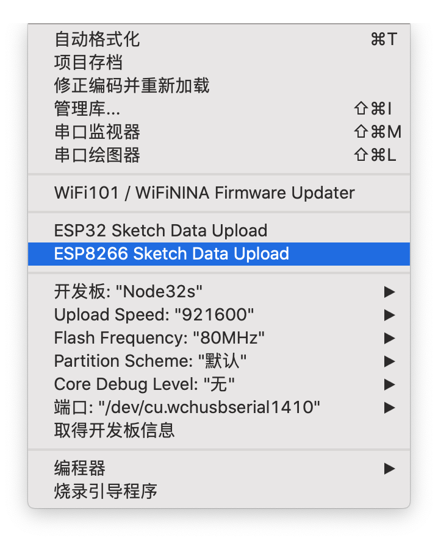

点击它就会自动创建文件系统，以后就不会再遇到错误提示了。


## 通过 PushDeer 推送信息到设备

当程序烧录完成，设备会初始化并自动连接服务器。如果没有初始化，可以按开发板上的reset进行重置。如果在烧录过程中串口无法连接开发板，也请按reset。

连接完成后可以看到「Waiting for message...」的提示。这时候我们就可以进行推送了。


推送直接使用 PushDeer 的API。

`POST /message/push`

|参数|说明|备注|
|-|-|-|
|pushkey|PushKey|
|text|推送消息内容|
|type|格式，选填|文本=text，markdown，图片=image，默认为markdown|

> ⚠️ 图片只能为256*256的JPG，否则显示会出问题

> ⚠️ 中文字库字库只有2000字，部分文字会乱码

> type 为 text 时，且 text 中包含 `♪` 字符时，蜂鸣器会发声

> type 为 image 时，text 中为要发送图片的URL

## 独立架设服务端

如果你希望为智能设备架设单一的服务端，可以单独使用 `pushdeeresp` 镜像：

```bash
docker run -e API_KEY=9LKo3 -e MQTT_PORT=1883 -e MQTT_USER=easy -e MQTT_PASSWORD=y0urp@ss -e MQTT_BASE_TOPIC=default -p 1883:1883 -p 80:80 ccr.ccs.tencentyun.com/ftqq/pushdeeresp 
```

启动后，支持`MQTT`和`HTTP`两种方式发送消息。

其中 `HTTP` 方式如下：访问 `IP/send` 即可发送消息，参数为：

|参数|说明|备注|
|-|-|-|
|key|API_key|用于限制权限访问|
|content|推送消息内容|
|type|格式，选填|文本=text，图片=bg_url，默认为text|
|topic|推送到主题，选填|会根据type推送到`${topic}_text`或`${topic}_bg_url`通道|

## 使用MQTT Board进行测试

[MQTT Board](http://mqtt-board-uzhqcnw-1256183612.cos-website.ap-guangzhou.myqcloud.com/) 是专门为`deeresp`开发的测试工具。

如果使用默认的MQTT服务器账号，只需要将 MQTT TOPIC 改为对应的值，即可向设备推送文字和图片。

在网页上可以把剪贴板中的图片粘贴上，然后工具会进行缩放为设备需要的尺寸和格式。点击发送，会生成一个一分钟有效的临时图片链接，并自动推送到设备。

也可点击下载，将处理好的图片上传到网上，在左侧`发送类型` 选择为 `图片`, `发送内容`粘贴为图片的URL即可推送给设备。

> 注意图片的URL必须为HTTP协议、JPG格式、不能有301/302等转向，最好为屏幕分辨率的两倍（256\*256、480*480）。

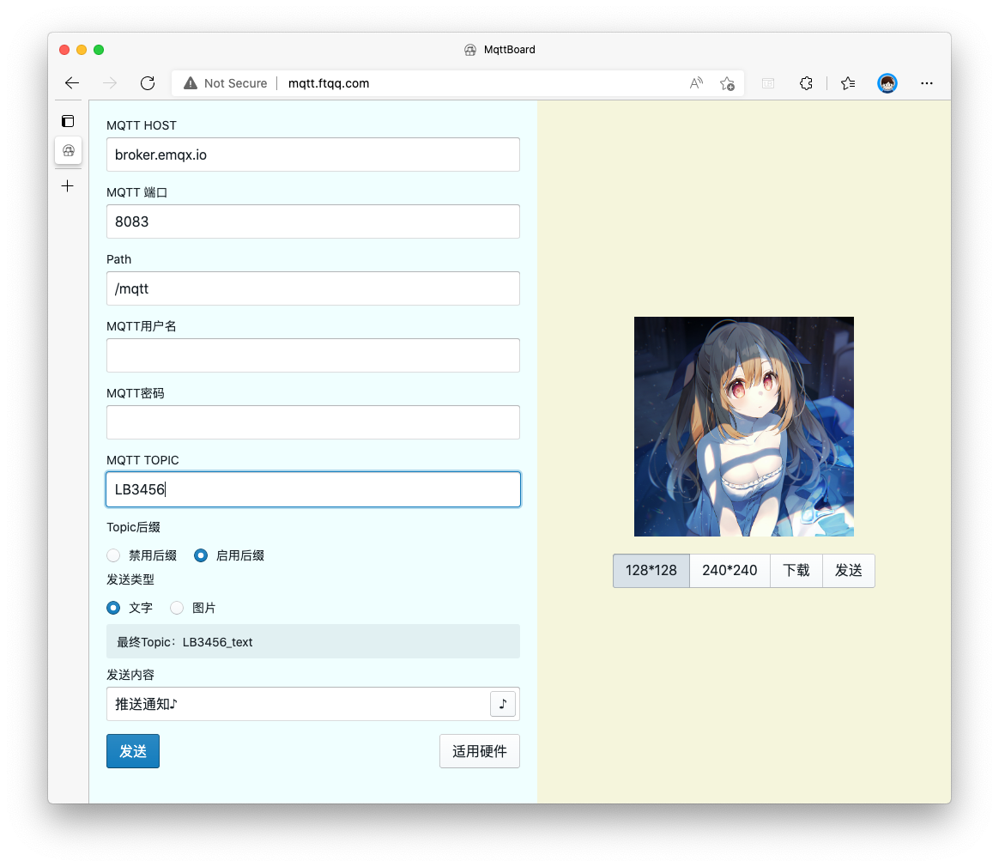  


## 用MQTTX进行测试

你也使用MQTTX来测试设备。

首先下载并安装[MQTTX](https://mqttx.app/zh)。
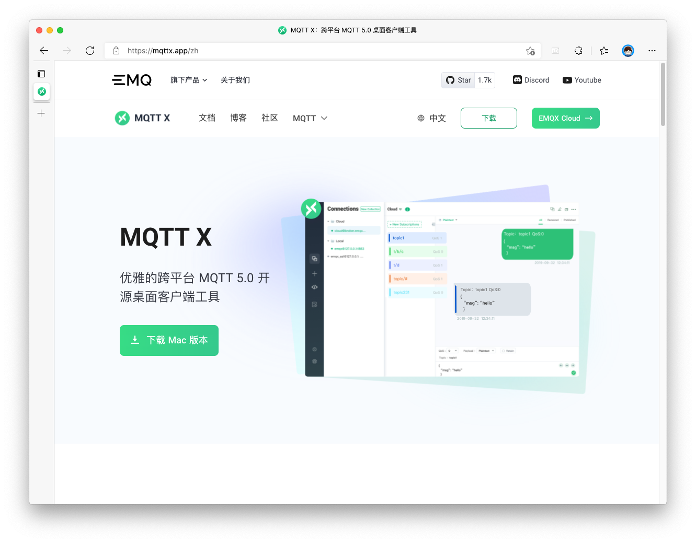

启动后创建一个新的连接，填入MQTT相关数据：

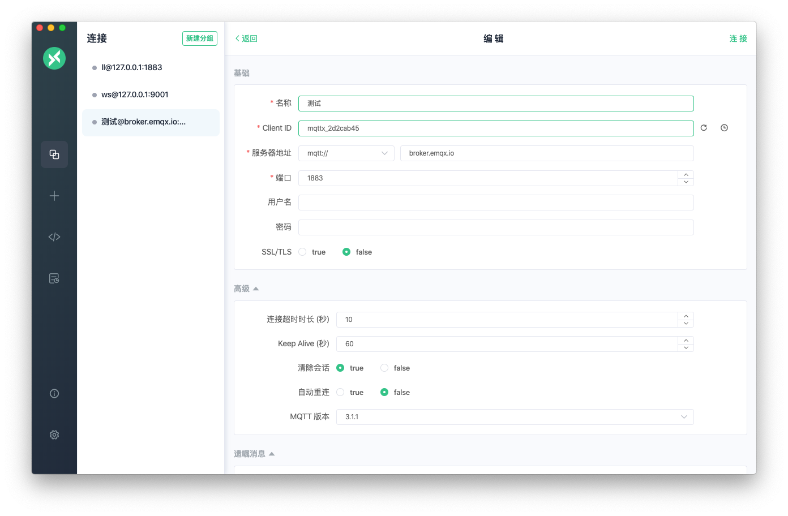


成功连接服务器后，就可以发送消息了。消息格式为纯文本，Topic为 `MQTT_TOPIC` + `_text`时发送文本；Topic为 `MQTT_TOPIC` + `_bg_url`时发送图片URL。

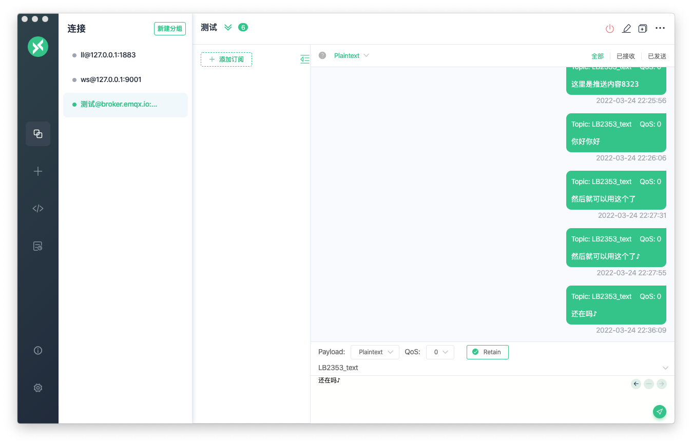


